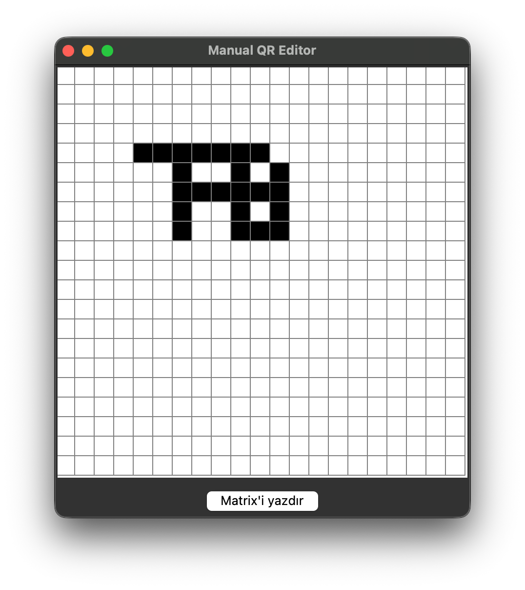
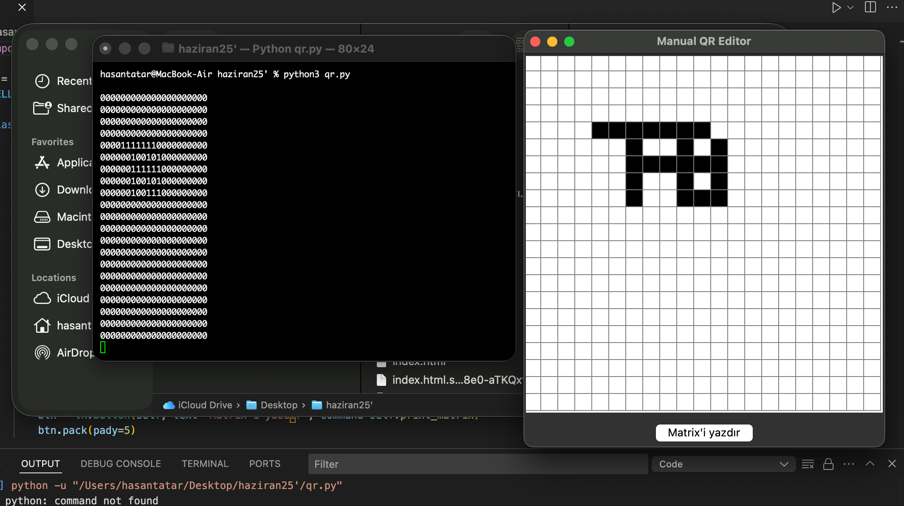

````markdown
# Manual QR Editor

`QREditor` is a simple Python application built with Tkinter that allows you to manually edit a QR code grid. You can toggle individual cells between black and white and print the resulting matrix to the console.

## Features

- 21×21 cell editing area (standard QR code size).
- Each cell is 20×20 pixels.
- Click a cell to toggle its color between black and white.
- "Print Matrix" button outputs the current matrix state to the console.

## Requirements

- Python 3.x
- Tkinter (included with standard Python distributions)

## Installation

1. Clone this repository or download the files.
2. (Optional) Activate your Python virtual environment:

   ```bash
   python -m venv venv
   source venv/bin/activate  # On Windows: venv\Scripts\activate
````

3. Ensure you have Python 3 and Tkinter installed.

## Usage

```bash
python qr_editor.py
```

* A 21×21 white grid will appear.
* Click on cells to turn them black or white.
* When done editing, click the "Print Matrix" button to view the matrix representation in the console.

## Customization

* Adjust the `N` and `CELL` constants at the top of `qr_editor.py` to change the grid size and cell dimensions.
* Modify the `fill` parameters in the `create_rectangle` and `itemconfig` calls to use different colors.

## Demo



```
```
